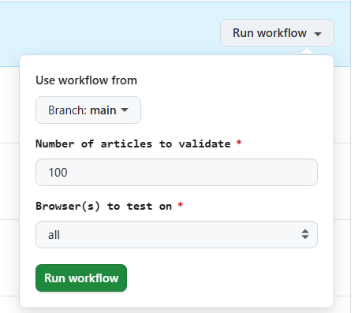

# QA Wolf Take Home Assignment

This repository contains my submission for the QA Wolf take-home assignment. The goal was to create a script using Playwright to validate that the first 100 articles on Hacker News's "newest" page are sorted correctly. The project can be found on [GitHub](https://github.com/rickcedwhat/qa-wolf-hacker-news).

While the assignment requested a simple script to be run with `node index.js`, I have also included a more robust testing solution that leverages the full power of Playwright's test runner and incorporates CI/CD with GitHub Actions.

## Getting Started

To get started, clone the repository and install the necessary dependencies.

```bash
git clone https://github.com/rickcedwhat/qa-wolf-hacker-news.git
cd qa-wolf-hacker-news
npm install
```

## Running the Tests

You can run the tests in two ways:

### 1\. Basic Script (as requested)

This command executes the simple script that logs the results to the console.

```bash
node index.js
```

### 2\. Robust Playwright Test Runner (Recommended)

This is a more powerful way to run the tests, offering detailed reports, tracing, and more. I highly recommend using this approach.

```bash
npm test
```

After running the tests, you can view a detailed HTML report of the test execution:

```bash
npm run report
```

This will open a local web page in your browser with a full breakdown of the test run, including screenshots, videos, and a step-by-step trace of the actions Playwright performed. This provides much greater insight into the test execution and makes debugging significantly easier.

## Continuous Integration and Delivery (CI/CD)

I have also set up a CI/CD pipeline using **GitHub Actions**. This workflow automatically runs the Playwright tests on every push to the `main` branch.

The workflow is defined in `.github/workflows/playwright-tests.yml` and allows for manual triggering with customizable inputs, which is particularly useful for QA testers. You can specify:

  * **Number of articles to validate**: `article_count` (default: 100)
  * **Browser(s) to test on**: `browser` (options: `all`, `chromium`, `firefox`, `webkit`)

  

This provides a flexible and automated way to ensure the script's functionality and cross-browser compatibility. Upon completion, the workflow uploads the Playwright report as a build artifact for easy access and review.

## Code Walkthrough

Here is a breakdown of the key files and logic in this project.

### `tests/hacker-news.spec.ts`

This file contains the main test suite for this assignment. It follows the "Given-When-Then" structure for clarity and uses the `NewestPage` Page Object Model (POM) to interact with the Hacker News "newest" page.

```typescript
import { test, expect } from '@playwright/test';
import { NewestPage } from '../pages/NewestPage';

const articleCount: number = parseInt(process.env.ARTICLE_COUNT || '100', 10);

test.describe('Feature: Hacker News Article Sorting', () => {

  test(`Scenario: The first ${articleCount} articles are sorted from newest to oldest`, async ({ page }) => {
    
    const newestPage = new NewestPage(page);
    let articleTimestamps: number[] = [];

    await test.step('Given I am on the Hacker News "newest" page', async () => {
      await newestPage.goto();
    });

    await test.step(`When I retrieve the timestamps of the first ${articleCount} articles`, async () => {
      articleTimestamps = await newestPage.getTimestampsForFirst(articleCount);
    });

    await test.step('Then the articles should be sorted in descending order of time', async () => {

    expect(articleTimestamps.length, `Article count should be ${articleCount}`).toBe(articleCount);
        
      for (let i = 0; i < articleTimestamps.length - 1; i++) {
        const currentTime: number = articleTimestamps[i]; 
        const nextTime: number = articleTimestamps[i + 1];
        
      expect(currentTime,`Article ${String(i+1).padStart(4,"0")} - Current time: ${currentTime} should be greater than or equal to nextTime: ${nextTime}`).toBeGreaterThanOrEqual(nextTime);
      }
      
      console.log(`Successfully validated that the first ${articleCount} articles are sorted correctly.`);
    });
  });
});
```

The test is broken down into three main steps:

1.  **Given**: The test navigates to the "newest" page on Hacker News.
2.  **When**: It retrieves the timestamps of the specified number of articles. The number of articles is configurable via an environment variable, defaulting to 100.
3.  **Then**: It iterates through the collected timestamps and asserts that each timestamp is greater than or equal to the next one, ensuring they are in descending order.

### `pages/NewestPage.ts`

This file implements the Page Object Model (POM) for the Hacker News "newest" page. This design pattern makes the test code cleaner, more readable, and easier to maintain by abstracting away the page-specific details from the test logic.

```typescript
import { expect, type Page, type Locator } from '@playwright/test';

export class NewestPage {
  readonly page: Page;
  readonly moreLink: Locator;
  readonly articleList: Locator;
  readonly ageSpans: Locator;

  constructor(page: Page) {
    this.page = page;
    this.moreLink = page.locator('a.morelink');
    this.articleList = page.locator('.athing');
    this.ageSpans = page.locator('span.age');
  }

  /**
   * Navigates to the "newest" page.
   */
  async goto(): Promise<void> {
    await this.page.goto('https://news.ycombinator.com/newest');
  }

  /**
   * Loads pages and scrapes timestamps in a loop until it
   * has the desired number of articles.
   * @param articleCount - The target number of timestamps to retrieve.
   * @returns An array of numeric timestamps.
   */
  async getTimestampsForFirst(articleCount: number): Promise<number[]> {
    const allTimestamps: number[] = [];

    while (allTimestamps.length < articleCount) {
      const elementsOnPage: Locator[] = await this.ageSpans.all();

      for (const el of elementsOnPage) {
        const timestampString: string | null = await el.getAttribute('title');

        if (timestampString) {
          const timestamp = parseInt(timestampString.split(' ')[1], 10);
          allTimestamps.push(timestamp);
        } else {
          console.warn('Found an age element with no title attribute.');
        }

        if (allTimestamps.length === articleCount) {
          break;
        }
      }

      if (allTimestamps.length < articleCount) {
        if (await this.moreLink.isVisible()) {
          await this.moreLink.click();
          await this.page.waitForLoadState('networkidle');
        } else {
          console.warn(`Could not find the 'More' link. Validating with the ${allTimestamps.length} articles found.`);
          break;
        }
      }
    }

    return allTimestamps;
  }
}
```

Key features of this class include:

  * **Locators**: It defines locators for the elements the test interacts with, such as the "more" link and the article age spans. This centralizes the selectors, so if the website's structure changes, you only need to update them in one place.
  * **`goto()` method**: A simple method to navigate to the "newest" page.
  * **`getTimestampsForFirst()` method**: This is the core of the page object. It retrieves the timestamps for a specified number of articles. It handles pagination by clicking the "more" link until the desired number of timestamps has been collected. It also includes error handling for cases where the "more" link might not be visible.